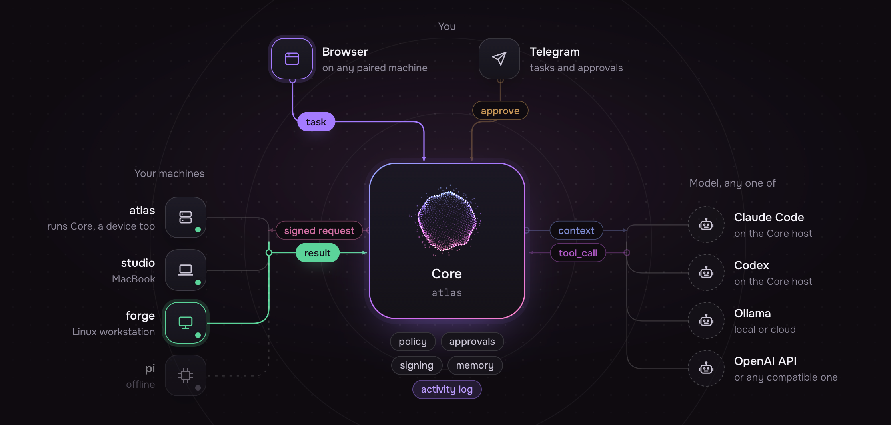
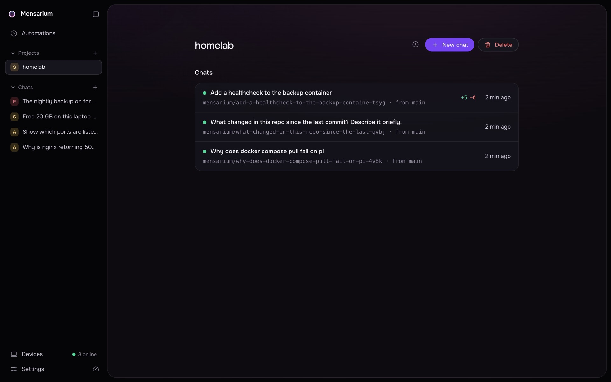
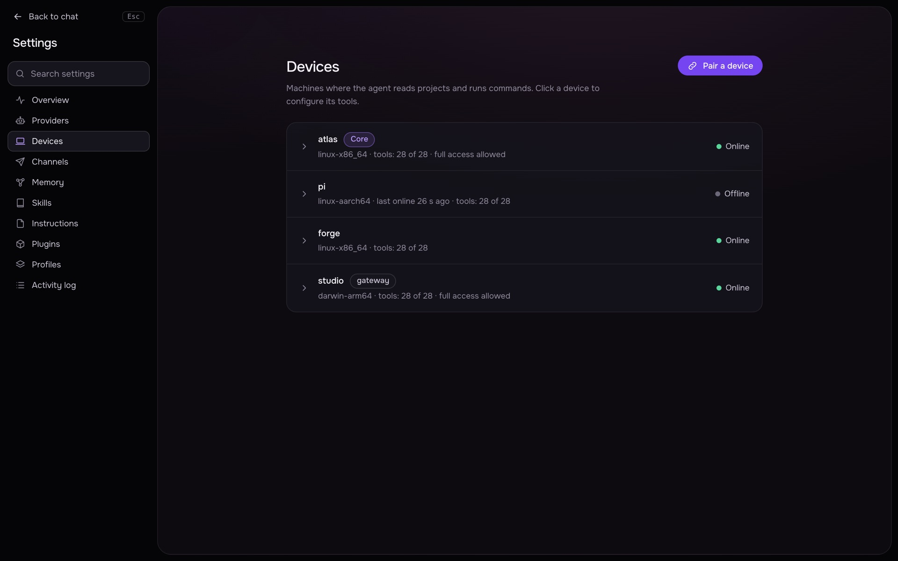
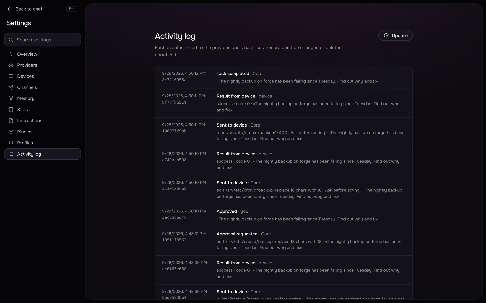
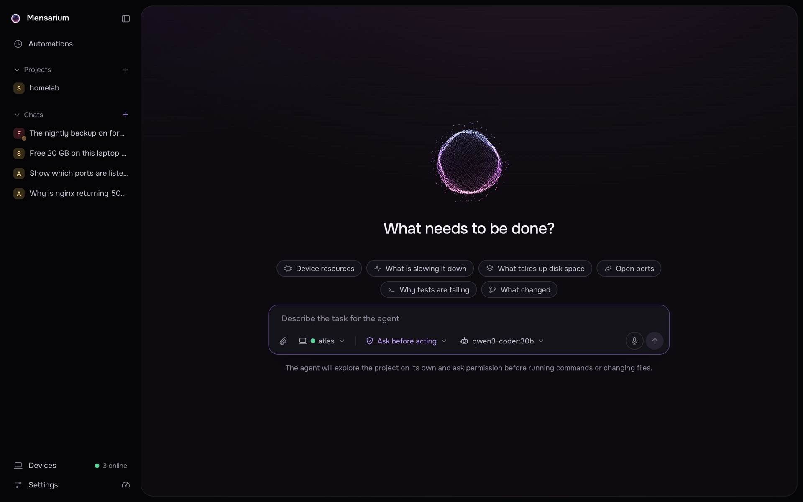

# Mensarium

**Your own agent cloud. One Core, every machine you own.**

Mensarium is a self-hosted agent harness. You install **Core** on a server or a laptop, pair your other computers, and give the agent work from a browser or Telegram. The model never touches a machine directly: it only proposes an action, Core checks it against a policy, asks you when the action changes something, and sends the machine a signed request. Everything, from chats to keys and the activity log, stays on your hardware.



- **One place for the agent.** Core talks to the model, keeps memory, plugins, skills, automations and a hash-chained activity log, and serves the web UI.
- **All your machines.** Mac and Linux machines join with a one-time code. They dial out to Core, open no ports, and run only requests Core signed.
- **You stay in control.** Reading is free; changing files, running programs and network access wait for your approval in the browser or in Telegram. Full access is a per-chat switch on devices that allow it.
- **Any model.** Claude Code or Codex already on the Core host, Ollama, llama.cpp, LM Studio, OpenAI, OpenRouter or any OpenAI-compatible endpoint.
- **One install line.** No Docker, no accounts, nothing hosted.

<table>
  <tr>
    <td width="50%"><br><sub>Projects: every chat works in its own copy on its own branch.</sub></td>
    <td width="50%"><br><sub>Automations: scheduled runs that finish with a result.</sub></td>
  </tr>
  <tr>
    <td width="50%"><br><sub>Devices: the Core host is a device too.</sub></td>
    <td width="50%"><br><sub>Activity log: every event is chained to the previous one's hash.</sub></td>
  </tr>
</table>

## Install

```sh
curl -fsSL https://mensarium.com/install.sh | sh
```

Works on macOS and Linux. The installer puts [uv](https://docs.astral.sh/uv/), Python 3.12 and the package into `~/.mensarium` and the `mensarium` command into `~/.local/bin`. It asks nothing; all setup happens in the command itself.

## Quick start

### 1. Set up Core

On the machine that should be the brain, a home server or the laptop you use most:

```sh
mensarium core
```

The wizard has four steps:

1. **Network**: the API port (8787 by default), who can reach Core (your network or only this machine) and the address other machines will use.
2. **LLM provider**: Claude Code and Codex on this machine are found automatically and need no key; otherwise pick Ollama, llama.cpp, LM Studio, OpenAI, OpenRouter or any OpenAI-compatible server and the default model.
3. **This machine as a device**: its name, the folders the agent may work in, which programs it may run, and whether full access, bash scripts and plugin servers are allowed here.
4. **Service**: run Core in the background so it starts on login or boot.

At the end it prints a one-time link to the web UI.

### 2. Open the web UI and give the first task

Open the printed link. Later, run `mensarium core open` for a new link or log in with the token from `mensarium core token`.



Pick the device and the access mode under the input, describe the task and send it. In **Ask before acting** the agent reads on its own and stops for your approval before it changes files, runs a program or goes to the network. **Full access** skips those stops on a device that allows it.

### 3. Add your other machines

On the Core machine, create a pairing code (it works once and expires in ten minutes):

```sh
mensarium core pair-code
```

The same code is in the web UI under **Devices → Pair a device**, together with both commands. On the other machine:

```sh
curl -fsSL https://mensarium.com/install.sh | sh
mensarium client
```

The client wizard asks for the Core address, the folders and programs the agent may use there, the pairing code, and two roles: run the agent's tools here (`worker`) and open the web UI here (`gateway`). The device shows up online within a few seconds. Running `mensarium client` on the Core machine itself is refused, because that machine is already a device.

### 4. Approve from your phone (optional)

In **Settings → Channels**, paste a bot token from [@BotFather](https://t.me/BotFather) and send the bot any message. The first account that writes becomes its owner, and the bot ignores everyone else. Messages become tasks, answers come back as messages, and approvals arrive as **Run once** and **Reject** buttons.

### 5. Keep it updated

```sh
mensarium update
```

On the Core machine this updates Core from mensarium.com. Every paired device gets a built-in automation that updates its client to the Core version, if the device allows remote updates; `mensarium update` on a client does the same by hand.

## How it works

Core is the only place that talks to the model. Clients only ever talk to Core, never to each other:

```
                     ┌──────────────────────────────┐
   Telegram ────────►│ core                         │
   (Core channel)    │  orchestrator, LLM, policy   │
   browser  ────────►│  UI, own device, approvals   │
                     │  sqlite, secrets             │
                     │  cron, WSS /v1/clients, CLI  │
                     └──────┬────────────┬──────────┘
                    WSS     │            │     WSS
              ┌─────────────┘            └──────────────┐
              ▼                                         ▼
 ┌──────────────────────────┐                  ┌──────────────┐
 │ client (laptop)          │                  │ client       │
 │  worker: runs tools      │                  │ (server 2)   │
 │  gateway: 127.0.0.1:8790 │                  │  worker      │
 │   └─ UI + tunnel to core │                  └──────────────┘
 └────────────▲─────────────┘
              │ http://127.0.0.1:8790
         ┌────┴────┐
         │ browser │
         └─────────┘
```

Every action the model proposes goes through the same path before anything runs:

```
LLM proposal → schema validation → target capability check → policy evaluation
→ risk classification → approval (if required) → signed request → target execution
→ signed result → artifact → observation added to context → next step
```

The machine checks the signature, the nonce, the deadline and the policy hash, and runs the action only inside the folders and programs you allowed. `.env` files, keys and tokens are cut out of what the agent reads.

## Projects

A project is a folder on one of your machines or a git repository given by URL. Every chat in a project works in its own copy of it on a `mensarium/<slug>` branch, so parallel chats never touch each other or your working copy.

- **From a folder**: pick the device and the folder in the wizard. Chats of such a project run on that device.
- **From a git link**: Core clones the repository onto its own machine and runs every chat there, so it keeps working with your laptop closed. **Sync** pulls origin again.
- **Next**: a folder project that keeps working on Core while its device is off, and delivers the results as branches when the device is back.

```sh
mensarium projects create --device NAME --path DIR
mensarium projects create --git URL
```

## Commands

| Command | What it does |
|---|---|
| `mensarium core` | Set up the Core (first run) or show its state |
| `mensarium core setup` | Reconfigure the Core |
| `mensarium core serve` | Run Core in the foreground |
| `mensarium core pair-code` | One-time pairing code (10 minutes) |
| `mensarium core open` | Open the web UI with a one-time login link |
| `mensarium core token [--rotate]` | Token for logging into the Core's web UI |
| `mensarium core backup -o file.pab` / `restore file.pab` | Encrypted bundle of the Core; on a move, clients are told the new address and follow it themselves |
| `mensarium client` | Set up this client (first run) or show its state |
| `mensarium client setup` | Reconfigure: pairing, folders, worker, gateway |
| `mensarium client pair --server URL --code CODE --root DIR` | Pair without the wizard (`--no-full-access`, `--no-remote-update`, `--no-shell` restrict the device) |
| `mensarium client move URL` | The Core moved: switch this client to its new address (no re-pairing) |
| `mensarium client run` | Run the worker in the foreground |
| `mensarium client gateway run` | Run the gateway (web UI) in the foreground |
| `mensarium client gateway open` | Open the web UI with a one-time login link |
| `mensarium client gateway token [--rotate]` | Token for logging into the web UI |
| `mensarium client gateway status` | Gateway state and Core connection |
| `mensarium client permissions` | Ask the OS again for screen recording and accessibility |
| `mensarium client plugins` | MCP servers the Core runs on this device |
| `mensarium status` | What is installed and running |
| `mensarium version` | Version, components on this machine, and available update |
| `mensarium update` | Update: Core from mensarium.com, a client from its own Core (`--check` only checks) |
| `mensarium plugins ...`, `mensarium mcp ...`, `mensarium skills ...`, `mensarium automations ...`, `mensarium projects ...` | Plugins, MCP servers, skills, automations and projects from the Core host |
| `mensarium service install\|stop\|restart\|logs core\|client\|gateway` | Manage the services |
| `mensarium uninstall --purge` | Remove services and data |

## Details

- LLM providers: Ollama Cloud, local Ollama, llama.cpp, LM Studio, OpenAI, OpenRouter or any OpenAI-compatible server — all through the OpenAI-compatible API — plus Claude Code and Codex CLI installed on the Core host (found automatically, connected with one click in Settings → Providers or in `mensarium core`; they think through your subscription, their own tools are switched off). They are added, checked and switched in Settings → Providers (or in the `mensarium core` wizard); the active provider changes without a restart and keys stay in Core secrets.
- Access modes per chat: "Ask before acting" (default) and "Full access". The Core host is a device by itself: a worker runs inside the Core process, attached over loopback with the same signed frames as any remote client, so nothing extra needs installing there (settings live in the `device` section of `core/config.yaml`; its key and login token live under `~/.mensarium/core/device/`). On start, a Core that finds a client in the same `~/.mensarium` paired with itself adopts it — device id, key, folders and login token move into Core, the client and gateway services are removed, and `client/` is renamed to `client.adopted`; the device's chats, projects and automations carry over.
- Full access (device agent 0.52.0+): no per-action confirmations for device tools, no workspace-root or program-allowlist restrictions, and system commands such as `sudo` and `systemctl` are permitted. File tools can read and change configuration/secret files; command environments and tool output are not stripped of credentials in this mode. Actual OS account permissions still apply. Explicitly disabled tools and the device owner’s `allow_full_access` opt-out remain effective. Ask mode retains its restrictions. Each signed request carries its mode independently, including concurrent chats and sub-agents.
- Device tools, all native in the client: read without confirmation (`files.list`, `files.read`, `files.search`, `files.stat`, `files.find`, `git.status`, `git.diff`, `system.info`, `process.list`, `net.ports`), changes with confirmation (`files.write`, `files.edit`, `files.mkdir`, `files.move`, `files.copy`, `net.http`), irreversible ones confirmed in Ask mode (`files.delete`, `process.kill`), and `shell.bash` for real bash scripts (reviewed and approved per script, `sudo` refused in Ask mode, can be disabled per device with `--no-shell`). `shell.exec` runs one program without a shell (allowlisted in Ask mode). Desktop tools appear when the device has the OS utilities: `screen.capture` (a screenshot the model sees as an image; set a "model for images" on the provider, e.g. `gemma4` on Ollama Cloud, and Core switches to it on steps with a screenshot), `screen.windows`, `input.mouse`, `input.type`, `input.key`, `app.open`, `system.volume`. On macOS the worker runs through `~/Applications/Mensarium.app`, so Privacy & Security shows Mensarium (not Python); it asks for Screen Recording and Accessibility after install and after every update (`mensarium client permissions` asks again); mouse moves need `brew install cliclick`.
- The web UI is served by Core itself and by each client's gateway: `mensarium core open` or `mensarium client gateway open` opens it with a one-time login link, or log in with a token (`mensarium core token` / `mensarium client gateway token`, `--rotate` to replace it). Core rejects requests whose `Origin` doesn't match its `Host`; the gateway also rejects requests whose `Host` or `Origin` don't match its own address (`allowed_hosts` when it listens on other interfaces). There is one user and pairing equals full access, so any of them shows the full Core state — all chats, devices, approvals, settings; revoke a device in Devices to cut it off. If Core is down, a client's gateway shows a "Core is offline" banner and recovers on its own once Core is back.
- Memory (Settings → Memory): notes with `[[Title]]` links, an interactive relationship graph, and dreaming — nightly consolidation of new chats into long-term memory with a diary. The agent searches, reads, and adds to memory via `memory.*` tools; pinned and important notes are included in the system prompt.
- Skills (Settings → Skills, or `mensarium skills` on the Core host) are `SKILL.md` files in the [Agent Skills](https://agentskills.io) format: a frontmatter with `name` and `description` and markdown instructions for one kind of work. Bundled skills ship with the release; your own live in `~/.mensarium/core/skills/<name>/SKILL.md` and replace a bundled skill with the same name. The system prompt lists only names and descriptions in an `available_skills` block; the agent loads a skill with `skills.read` when the task matches (and reads files the skill ships with `path`). The optional `metadata.mensarium` block gates a skill: `os`, `requires.tools` (globs like `mcp.github.*`), `always`.
- Plugins (Settings → Plugins, or `mensarium plugins` / `mensarium mcp` on the Core host) extend the agent: device tools are command templates sent to a client as `shell.exec`; Core tools run in Core (`web.search` through Brave Search, `web.fetch` with internal addresses blocked); MCP servers run in Core or on a chosen device and give the agent `mcp.<server>.<tool>`. Plugins have a `category` the Plugins page groups them by, settings with secret fields that stay in Core, a risk level that decides approvals, and a catalog bundled with the release and refreshed from mensarium.com. A client runs an MCP server only if its program is in the device's allowlist and plugins from Core are allowed there. The catalog covers code hosting, docs and web search, browsers, databases, cloud and observability services, productivity and chat tools; servers that need your files, browser, docker or CLI logins run on a device. When a request needs something the agent has no tool for (web search, a browser, GitHub...), it looks up the catalog with `plugins.find` and proposes a plugin with `plugins.install`: the install always waits for your approval, even in full access, keys are entered only in Settings → Plugins, and a server that runs on a device is placed on the chat's device.
- Channels (Settings → Channels): talk to the agent from a messenger. Telegram: paste a bot token from @BotFather; the first Telegram account that writes to the bot becomes its owner and the only one it listens to. Messages become tasks on the device chosen in Settings → Channels, otherwise the first paired device, and continue the same chat; `/new` starts another, `/stop` stops the task. Approvals arrive as buttons, the answer as a message; the token stays in Core secrets.
- Automations (the Automations page above New chat, or `mensarium automations` on the Core host): a task the agent runs on its own on a schedule — once, every N minutes, or by cron — on a chosen device and access mode. Runs are logged with their result or error; repeated failures back off and eventually disable the automation, and a result can be sent to Telegram. The agent can propose and create an automation itself, but only after you say yes in the chat. Every paired device also gets a built-in automation that checks the client version every two hours and updates it to the Core version when the device allows remote updates; delete or disable it like any other.
- The web UI is available in English (default) and Russian, switchable in Settings → Overview.
- The worker verifies the signature, nonce, request TTL, policy hash, and presence of approval; paths are restricted to selected folders, programs to an allowlist; `.env` files, keys, and tokens are never read and are stripped from output.
- Core storage is SQLite in `~/.mensarium/core`; secrets are files with 0600 permissions and never reach the UI, prompts, or clients.
- After a Core restart, unfinished tasks move to `PAUSED` and do not resume on their own.

## Development

```sh
make dev     # .venv with the package in editable mode
make lint    # ruff + mypy
make dist    # dist/: install.sh, archive, and latest.json for distribution (requires clean git)
make core    # Core in the foreground (needs ~/.mensarium/core/config.yaml, see mensarium core)
```

A push to `main` runs `make test`; if the version in `src/__init__.py` has no `vX.Y.Z` tag yet, GitHub Actions (`.github/workflows/release.yml`) builds `make dist`, publishes it to mensarium.com, and creates the tag and a GitHub release with notes from `CHANGELOG.md`. Installed Cores pick it up with `mensarium update`.

### The site

The page at [mensarium.com](https://mensarium.com) lives in `landing/` and uses the product's own `styles.css`, `orb.js` and fonts, copied from `src/web` by `make site-vendor`. `make site-serve` shows it on http://127.0.0.1:8800, and `make site` builds `dist/site`, which the release workflow publishes. Its screenshots come from a throwaway Core with a mock model and three paired clients; see `landing/stand/README.md` to shoot them again after UI changes.
