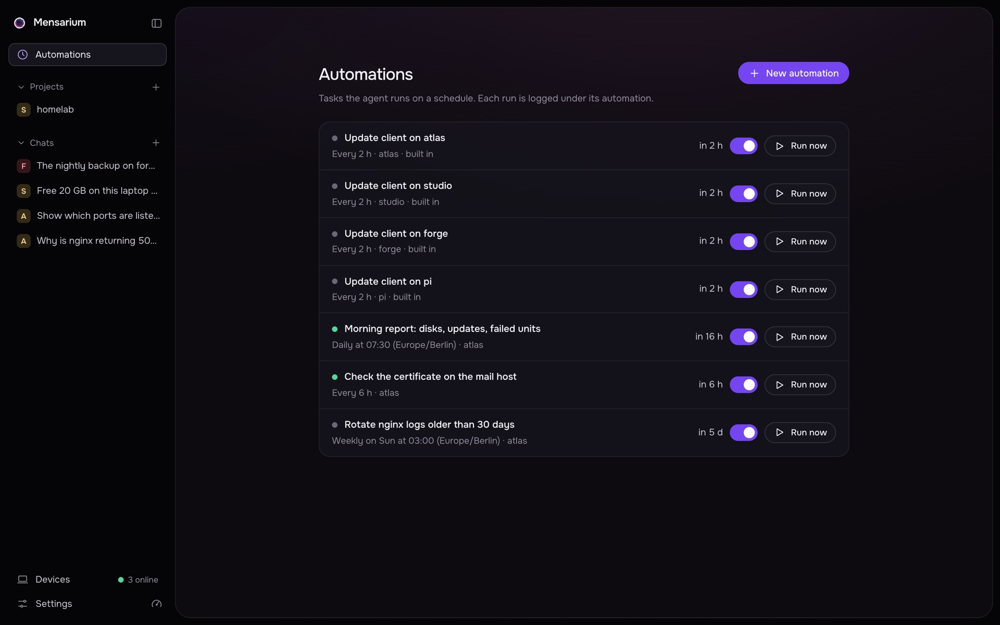

# Automations

An automation is a task the agent runs on its own, on a schedule, without anyone watching the chat. Each run starts a fresh task from a fixed prompt, on a chosen device and access mode, and reports back through whatever notification channel is set up.



## Creating an automation

Automations are normally created by the agent itself, from a chat: you ask for something recurring ("check my inbox every morning and summarize it"), the agent proposes a schedule with the `automations.create` tool, and this always requires your explicit approval — even in full-access mode. The agent is instructed to call `automations.list` first to avoid duplicates, and to never create one without you having confirmed the schedule in plain words.

The `automations.create`/`automations.list`/`automations.delete` tools are only available in your own top-level chats — not to sub-agents, and not inside a run of an automation itself (those get `device.update` instead, see below).

There is no `mensarium automations create` CLI command; automations are created via the agent or the web UI's Automations page (`POST /v1/automations`, `AutomationCreate` body: `name`, `prompt`, `schedule`, `target_id`, `mode`, `model`, `provider`, `timeout_s`, `notify`, `delete_after_run`, `enabled`).

## Schedule kinds

An automation's `schedule` is one of three kinds:

| Kind | Field | Meaning |
|---|---|---|
| `at` | `at` (ISO 8601 datetime with a UTC offset, e.g. `2026-10-01T09:00:00+03:00`) | Runs once, then disables itself (or is deleted, if "delete after run" is set) |
| `every` | `every_s` (seconds, minimum 60, maximum 366 days) | Runs on a fixed interval, starting `every_s` seconds from now |
| `cron` | `expr` (5 fields: `minute hour day-of-month month day-of-week`) | Standard cron syntax; names allowed for month (`jan`…`dec`) and weekday (`sun`…`sat`), `*`, ranges (`1-5`), lists (`1,3,5`), and steps (`*/15`) |

Every schedule also carries a `tz` (IANA timezone name, e.g. `Europe/Moscow`); it is required for all kinds and used to interpret `cron` fields and to display `at` times. Times are otherwise stored and evaluated in UTC.

## Device, mode and model

Each automation has its own `target_id` (device), `mode` (`ask` or `full`, same access modes as a regular chat), and optional `model`/`provider` (falling back to the default model if unset). A run creates a task on the `coding-agent-v1` profile, and its `timeout_s` (default 3600, 60–86400) bounds how long Core waits for a result before canceling it and recording a `timeout`.

## Manual run

```sh
mensarium automations run AUTOMATION_ID
```

or `POST /v1/automations/{id}/run`. This starts an immediate run with `trigger: manual`, independent of the schedule (an automation can only have one run in flight at a time; a manual run while one is already running returns an error).

## Run statuses

A run's `status` is one of: `running`, `ok`, `error`, `timeout`, `canceled`, `lost`. `lost` is used for a run that was still `running` when Core restarted (its task is paused, but the run itself is recorded as lost rather than resumed). At most 3 automations run in parallel across the whole Core; others due at the same time wait for a slot on the next scheduler tick.

The scheduler ticks every 15 seconds. A run that comes due more than 2 minutes late (Core was down, or busy) is started with `trigger: catchup` instead of `schedule`.

## Backoff and auto-disable

After a failing run (`error`/`timeout`, not `canceled`), the automation's next run is delayed rather than run at its normal schedule time, following the sequence 30s → 60s → 5m → 15m → 60m (the failure count controls how far into this list to look; further failures repeat the last value). A successful run resets the failure count to zero. After **10 consecutive failures**, the automation disables itself (`disabled_reason: "consecutive-failures"`).

An `at` (one-shot) automation disables itself after a successful run (`disabled_reason: "one-shot-done"`), or is deleted outright if `delete_after_run` was set. A schedule that can never fire again (e.g. a `cron` expression with no match in the next year) is disabled with `disabled_reason: "never-fires"`.

## Unattended runs and NO_REPLY

A run's system prompt includes an `## Unattended run` block telling the agent nobody is reading the chat live: it must finish with a result or a completed action, not a question, and should wait for approvals (they are answered separately, e.g. from a phone). If there is nothing worth reporting, the agent is told to reply with exactly `NO_REPLY`; such a reply is treated as "no result" and is not recorded as run output or sent as a notification.

## Notifications

If an automation has `notify: true` and a Telegram channel is connected (see [Channels](channels.md)) with an owner chat id, Core sends a message after each run:

- On success with a non-empty, non-`NO_REPLY` result: the automation's name and the result text.
- On any other non-`canceled` outcome (`error`, `timeout`, `lost`): the automation's name and `run <status>`, plus the error text if there is one.
- Nothing is sent for `canceled` runs, or for a successful run with no reportable result.

Separately, while a run is waiting on your approval, Core sends one reminder message with a link to the chat (`{public_url}/#/chat/{task_id}`), so you can go approve or reject the pending action.

## Retention of runs

Runs are pruned after each finished run, as long as the automation itself survives that run (a one-shot automation with "delete after run" set removes itself and all its history instead): at most 200 runs are kept, and any run older than 7 days beyond that is removed, along with the task/chat transcript it created — unless that task is still actively running. Deleting an automation deletes all of its recorded runs and their tasks too.

## Built-in client update automation

Every device gets a built-in automation "Update client on `<device name>`" automatically: `created_by: "core"`, runs every 2 hours in `ask` mode, and calls the Core tool `device.update`. This tool compares the client's reported version against the Core version and starts a remote update if the client is behind — the device itself still has final say (its `allow_remote_update` setting can reject it). If the client is already current, offline, or disallows remote updates, the tool does nothing and the run produces no notification. `device.update` is only available inside automation runs (`automation_id` set on the task), never in a normal chat.

This automation is created once per device when it's first paired (`ClientHub.hello` → `AutomationManager.add_device`); devices paired before this feature existed are seeded with it once at Core startup (tracked by a `automations.update_seeded` flag so it only runs once).

## CLI usage

```sh
mensarium automations list
mensarium automations show AUTOMATION_ID
mensarium automations run AUTOMATION_ID
mensarium automations enable AUTOMATION_ID
mensarium automations disable AUTOMATION_ID
mensarium automations remove AUTOMATION_ID [--yes]
```

`list` shows id, name, schedule (human-readable, e.g. "every 2 h", "once at 2026-10-01 09:00 (Europe/Moscow)", "cron 0 9 * * 1-5 (UTC)"), device, next run time (or `off` with the disable reason), and last run status. `show` additionally prints mode, model, timeout, notification setting, who created it (`user` or `core`), and its 10 most recent runs with status, duration and a one-line summary of the result or error. `remove` deletes the automation and its run history; it asks for confirmation unless `--yes`/`-y` is given.

There is no CLI command to create or edit an automation's prompt or schedule — that happens through the agent or the web UI's Automations page.
