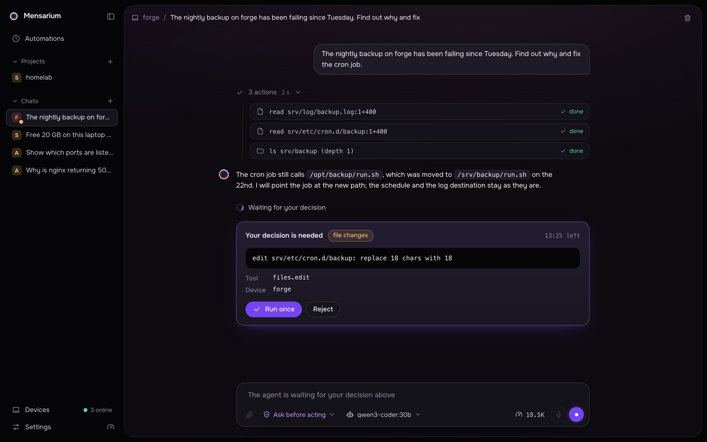

# Using the web UI

This page covers the web UI: layout, starting a chat, approvals, controlling a running task, attachments, dictation, plans and sub-agents, and language.

<table>
  <tr>
    <td width="50%"> A new chat: device, access mode and model under the input.</td>
    <td width="50%"> An approval card: the agent waits before editing a file.</td>
  </tr>
</table>

## Layout at a glance

The sidebar has, top to bottom:

- **Automations** — link to the automations list (see [docs/automations.md](automations.md)).
- **Projects** — projects with a "+" to create one; each project can expand into its own chat column (see [docs/projects.md](projects.md)).
- **Chats** — every chat not tied to a project, newest first, with a "+" for a new chat and a delete button per chat. A colored dot on each chat's device badge shows chats that need a look (running, waiting for a decision, or errored).
- **Devices** — link to Settings → Devices, with an online/total count.
- **Settings**, a **Memory graph** shortcut and a **Usage limits** gauge button.

**Settings** has these pages: Overview, Appearance, Providers, Devices, Channels, Notifications, Memory, Skills, Plugins, Secrets, Profiles, Activity log — searchable from a box at the top of the settings sidebar. (User instruction files live inside the Memory page, not a separate page — see [docs/memory.md](memory.md).)

## Starting a chat

The new-chat screen (or a project's "new chat" action) has a text box and three chips:

- **Device** — which paired device the agent works on. Defaults to the last-used device, or this browser's own device, or the first online one. Offline devices are shown disabled in the picker, with a "Pair a new device" entry at the bottom.
- **Access mode** — a two-way switch:
  - **Ask before acting** — reads right away; running programs, changing files and network access wait for approval.
  - **Full access** — any file, program or system command without asking, within OS permissions. Picking it asks for confirmation first, and is blocked (with an explanation) if the target device doesn't allow full access.
- **Model** — a searchable list of every configured provider's models; leaving it unset uses the Core-wide default model (Settings → Providers), which also becomes the default for the next new chat when changed here.

A few starter templates (device resources, what's slowing it down, disk usage, open ports, why tests fail, what changed) fill the message box with a ready-made prompt. Sending creates the task (`POST /v1/tasks`) and opens its chat.

## Approvals

When a proposed tool call needs a decision, the chat shows a card with:

- the risk level as a pill: `read`, `write` ("file changes"), `execute` ("run a program"), `network` ("network access"), or `destructive` ("irreversible action"),
- the command or the tool's display text (e.g. `$ <command>` for shell tools),
- a metadata list: tool name (unless it's `shell.exec`), device, working folder, timeout, and any secret names the call would use,
- the input data or prompt argument in full, when the tool has one,
- a countdown of time left to decide.

Buttons are **Run once** and **Reject**. For `destructive` risk, **Run once** stays disabled until a checkbox "I understand this action can't be undone" is checked. Deciding calls `POST /v1/approvals/{approval_id}/decision`; once decided, the card shows the outcome (allowed / rejected / "time to decide ran out") in place of the buttons. An approval left undecided expires; an approval from a sub-agent shows a pill with the sub-agent's label and gets logged into that sub-agent's own panel rather than the main thread once resolved.

A secret request from the agent shows a similar card asking for a value (see [docs/secrets.md](secrets.md)), with **Save**, **Devices…** and **Decline**.

## Pausing, stopping and resuming

The composer's round send button doubles as task control:

- While the agent is working, it becomes a **Stop** button (pause) — posts to `POST /v1/tasks/{id}/pause`.
- After a pause (or a recoverable failure), with no new text typed, it becomes a **Resume** button — posts to `POST /v1/tasks/{id}/resume`.
- Otherwise it sends a new message (`POST /v1/tasks/{id}/messages`), which is only accepted while the task is idle or in a terminal state.

There is no separate cancel button in this flow, but the API also exposes `POST /v1/tasks/{id}/cancel`, which stops a task for good (status `CANCELED`) rather than leaving it resumable.

## Task states

| Status | Shown as | Resumable |
|---|---|---|
| `NEW`, `VALIDATING` | Starting | — |
| `PLANNING` | Thinking | — |
| `WAITING_APPROVAL` | Waiting for a decision | — |
| `EXECUTING` | Executing | — |
| `OBSERVING` | Parsing the result | — |
| `SUCCEEDED` | Done | — |
| `FAILED` | Error | no |
| `FAILED_RECOVERABLE` | Interrupted, can be resumed | yes |
| `CANCELED` | Stopped | no |
| `PAUSED` | Paused | yes |
| `IDLE` | New (empty project chat waiting for its first message) | — |

Only `PAUSED` and `FAILED_RECOVERABLE` chats can be resumed. **After Core restarts, every task that was active gets set to `PAUSED` with the reason "Core restarted"** — nothing resumes automatically; open the chat and resume it (or send a new message) yourself. Any approval still open at that point is expired.

## Attachments

Attach files by clicking the paperclip, dragging them onto the composer, or pasting them (e.g. a screenshot from the clipboard). Limits, enforced both in the browser and again by Core:

- up to **10 files** per message,
- up to **12 MB** per file.

Core determines the real file type from its bytes, not the browser-reported MIME type or extension:

| Detected type | Accepted signatures |
|---|---|
| image | PNG, JPEG, GIF, WebP |
| pdf | `%PDF` header |
| docx | a zip containing `word/document.xml` |
| text | anything that decodes strictly as UTF-8 |

Anything else is rejected as "unsupported file type". Each upload (`POST /v1/attachments?name=...`) is stored as an artifact and stays unbound for 24 hours until a message references it, after which unreferenced uploads are swept away.

When a message with attachments is sent, Core extracts text so the model never touches the raw file:

- **Images** are passed to the model as an image (when the active model accepts images) with no text extraction.
- **PDF** text is extracted page by page (up to 200 pages; extra pages are noted, not included), including a note for password-protected or unreadable PDFs.
- **DOCX** text is pulled from `word/document.xml` (up to a 32 MB XML size internally).
- **Plain text** files are decoded as UTF-8.

Extracted text is capped at **60,000 characters** per file; past that, the file's `<attachment>` block in the prompt is marked truncated. Attachment content is explicitly framed to the model as untrusted data, never as instructions.

If the active model doesn't accept images, image parts of the conversation (attachments and screenshots alike) are replaced with a note telling the agent the picture isn't visible to it and to ask the user or switch to a model that supports images in Settings → Providers; what the user sees in the chat is unaffected.

## Voice dictation

The microphone button next to the composer uses the browser's built-in speech recognition (Web Speech API), available in Chrome, Edge and Safari. It requires a secure context (HTTPS or localhost) — otherwise it's shown disabled with an explanation. There is no server-side speech component; dictated text is inserted into the textbox as you speak, appending to whatever was already typed.

## Plan strip and sub-agents

**Plan** — for a multi-step task, the agent can maintain a checklist (`plan.update` tool) shown as a collapsible strip above the composer, with a "done/total" count; it auto-expands while a step is in progress and folds once everything is done or the task isn't running.

**Sub-agents** — the agent can spawn sub-agents (`agent.spawn`) to work in parallel on the same device with the same tools; **at most 4 run at once**. A chip near the model selector shows the sub-agent count (and a live dot while any are running); clicking it opens a modal listing each sub-agent's label, model, status, its assignment text, its own activity log and its final report. A sub-agent's approvals still need your decision, appearing inline in the main chat and then moving into that sub-agent's own log once resolved.

## Language

Settings → Appearance → Interface language switches between **English** and **Русский (Russian)**; the login screen also has a compact switch. Changing it reloads the page — all UI strings are English at the source, translated to Russian client-side.

## Usage and limits

A token-usage chip in the composer shows this chat's token spend (including its sub-agents) and, when the active model reports a context window, how full the context is as a percentage. Clicking it opens a breakdown by model: calls, input tokens, tokens served from cache, tokens written to cache, and output tokens.

The gauge button at the bottom of the sidebar opens **Usage limits**: Core checks the active provider's own rate/usage limits on its own schedule — every 10 minutes for Codex and OpenRouter, every 30 minutes for Claude Code (through its usage API, without spending quota) — and shows each usage window with a refresh button to check immediately. When a window gets close to its limit, a banner appears above the composer with a link back to this view.

See also: [docs/security.md](security.md) for risk levels, approval rules and redaction in depth; [docs/memory.md](memory.md) for how notes, instructions and skills fill the system prompt; [docs/projects.md](projects.md) for project chats and branches; [docs/automations.md](automations.md) for scheduled/automation runs.
