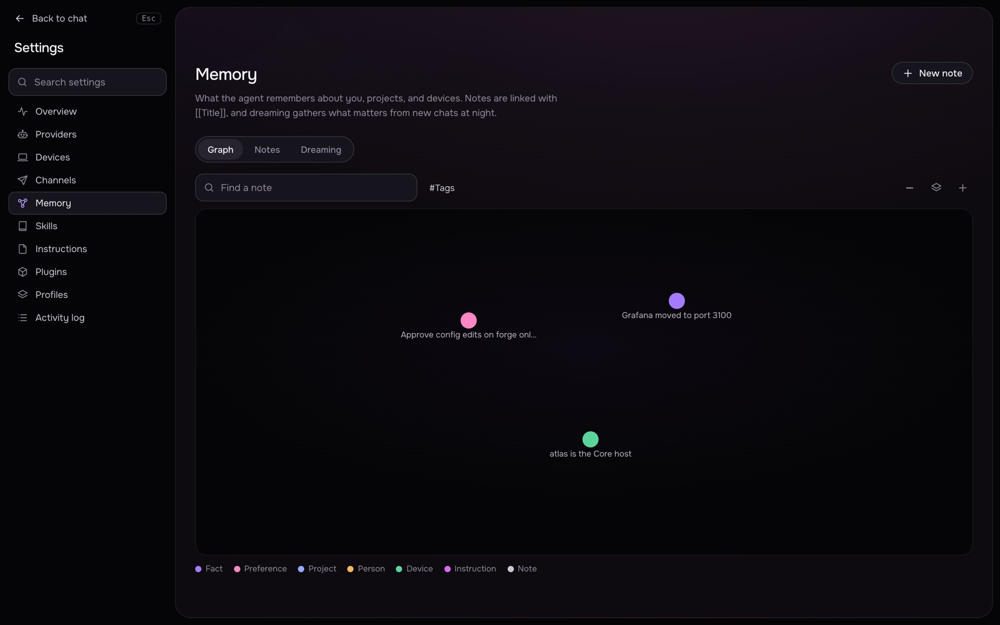

# Memory

Mensarium keeps two kinds of long-term state: **notes** (facts the agent or the user record, connected by links) and **instruction files** (markdown the user edits directly). Both are read into the system prompt of every chat. This page covers the memory graph, the `memory.*` tools, the nightly consolidation process ("dreaming"), and the instruction files.

## Notes

A note has a title, a body (markdown, may contain `[[Wikilinks]]` to other notes by title), a kind, tags, an importance from 1 to 10, and a pinned flag. Kinds: Fact, Preference, Project, Person, Device, Instruction (`howto`), Note. Source is one of `you` (created in the UI), `agent` (saved during a chat) or `dream` (written by dreaming).

Open **Settings → Memory**, which has three tabs:

- **Graph** — the central note in the middle with other notes on rings around it, colored by kind. Chips above the graph filter by kind and show a count per kind; a search box jumps to a note by title. Clicking a note opens a side panel with its body, backlinks, and actions to edit, create a linked note, link a detached note to the center, or make it the central note. A note linked to no other note (a "detached" note) gets a prompt to link it to the center. Links to a title that has no note yet render as a ghost node with an option to create it.
- **Notes** — a flat, searchable, filterable list of notes, plus the instruction files (below).
- **Dreaming** — the nightly consolidation run: schedule, thresholds, phase progress, and the dream diary (see below).

The **central note** is the note the graph is built around (by default a note titled "About me"); any note can be made central. Deleting the central note is blocked — pick another central note first.

A note's editor lets you set title, kind, importance, tags, an "Always in context" switch (pinned), a link target (when creating from a linked-note action), and the body text.

### How notes reach the prompt

`Memory.context()` ([src/core/memory.py](../src/core/memory.py)) builds the `## Memory` block added to every system prompt: notes are sorted by pinned, then importance, then recall count, and appended until a 2500-character budget is used. A pinned note keeps up to 600 characters of its body in this summary; an unpinned note keeps up to 200. This is why the "Always in context" switch matters for a note that should never fall out of the budget.

### memory.* tools

The agent can search, read and save notes with three tools (always available, not project- or device-specific):

| Tool | Arguments | Behavior |
|---|---|---|
| `memory.search` | `query`, `limit` (1-20, default 8) | Scores notes by term matches in title/tags/body; returns a snippet per hit and marks the notes as recalled. |
| `memory.read` | `title` (exact) | Returns the full note body and its backlinks; if no exact match, suggests the closest titles. |
| `memory.save` | `title` (≤120 chars), `content` (1-4 sentences, ≤4000 chars), `kind` (fact/preference/project/person/device/howto), `tags` (≤8) | Creates a new note, or appends to the existing note with the same title (never overwrites). A new note with no link to any known note is auto-linked to the central note, keeping the graph connected. |

Titles cannot contain `[`, `]`, `|`, `#`, or newlines (these characters are reserved for wikilink syntax). Note bodies are capped at 20000 characters; secrets are stripped from note content and tool arguments via the redaction helper before storage.

## Dreaming

Dreaming is a background nightly job that reads recent chats and writes durable notes on its own, so the agent does not have to call `memory.save` for everything. It runs in four phases, shown live in the UI while a run is in progress:

1. **Light sleep** — gathers new chats since the last run (up to 40 chats, up to ~3500 characters per chat digest): the user's messages, the agent's replies, and one-line summaries of tool actions. Command output and raw tool results are not included.
2. **REM** — sends the digests (in batches up to ~14000 characters) to the LLM, which proposes candidate memories with a title, kind, content, tags, an importance 1-10, links to existing notes, and short "themes" for the run.
3. **Deep sleep** — candidates below the configured importance threshold are discarded. The rest are merged by title: an existing note is appended to (never rewritten) or, if nothing new, just has its importance bumped ("reinforced"); a new note is created only up to 15 new notes per run.
4. **Diary** — the agent writes 3-6 first-person sentences (in the language the chats were in) about what it remembered and what it let go, shown as the run's diary entry.

Settings (Settings → Memory → Dreaming, `PUT /v1/memory/dreams/settings`):

| Setting | Default | Meaning |
|---|---|---|
| `dreaming` | on | Whether the nightly schedule runs at all. |
| `hour` | 3 | Local hour (0-23) the run starts, in the browser's timezone (falls back to the Core host's timezone). |
| `min_importance` | 6 | Candidates below this importance are discarded rather than saved. |

A night with no new chats since the last run is skipped silently. Only one run happens at a time; **Settings → Memory → Dreaming → Run now** (`POST /v1/memory/dreams`) starts one immediately. If Core restarts mid-run, that run is marked failed on the next startup rather than resumed.

## Instruction files

Four markdown files the user edits and every chat reads at the start of the system prompt, listed in the "Instruction files" section of Settings → Memory → Notes (and previewable from the graph's file chips):

| File | Purpose |
|---|---|
| `AGENTS.md` | Operating instructions: rules, priorities, how to work. |
| `SOUL.md` | Persona and tone. |
| `IDENTITY.md` | The agent's name and style. |
| `USER.md` | Who the user is and their durable preferences. |

Files live as plain markdown at `~/.mensarium/core/instructions/AGENTS.md` (and `SOUL.md`, `IDENTITY.md`, `USER.md`) — see [docs/configuration.md](configuration.md) for the general `~/.mensarium` layout — and are included in `.pab` backups. **Until the user writes their own, a built-in default ships with Mensarium** ([src/instructions/](../src/instructions/)); editing a file in the UI writes a custom copy, and **saving an empty file deletes the custom copy so the built-in default is used again**.

Each file is capped at 20000 characters in the prompt (`INSTRUCTION_FILE_CHARS`), and the total across all instruction files is capped at 60000 characters (`INSTRUCTIONS_PROMPT_CHARS`); content beyond the per-file limit is cut with a `[cut here: ...]` marker. They appear in the prompt as a `## Instructions from the user` block, and are explicitly reference material: the harness rules above them still take precedence, and they never grant extra tools or permissions.

There is no separate Instructions page: files are edited from the memory graph's central card and from the Notes tab (`GET /v1/instructions`, `PUT /v1/instructions/{name}`).

See also: [docs/chats.md](chats.md) for how memory and instructions fit into a chat's system prompt alongside skills and plugins, and [docs/security.md](security.md) for how note and tool-argument content is redacted before storage.
