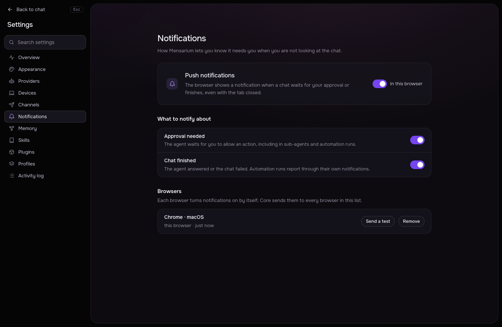

# Notifications: browser push

Mensarium can show a browser notification when a chat needs your approval or finishes, even with the tab closed, using the standard Web Push API — no external push service account or app is required beyond the browser's own push infrastructure.

## Requirements

Web Push only works in a [secure context](https://developer.mozilla.org/en-US/docs/Web/Security/Secure_Contexts): the web UI must be served over **HTTPS**, or accessed as **localhost** (e.g. via the gateway loopback on the same machine, `127.0.0.1`). If the page is open over plain HTTP on a non-localhost address, Settings → Notifications explains this and notifications cannot be enabled. The browser must also support `serviceWorker`, `PushManager` and `Notification` (all current major browsers do).

## Enabling in Settings → Notifications

Open **Settings → Notifications** and turn on "Notifications in this browser". This:

1. Asks the browser for notification permission (declining shows "The browser did not allow notifications for this site.").
2. Registers the service worker at `/sw.js` ([src/web/sw.js](../src/web/sw.js)).
3. Subscribes to push using Core's VAPID public key, and sends the subscription (`endpoint`, encryption keys, browser language, a human-readable browser/OS label) to Core (`POST /v1/push/subscriptions`).

Each browser subscribes independently — Core keeps a list of subscriptions (Settings → Notifications → Browsers) and sends a push to every one of them, up to 20 stored subscriptions (oldest dropped first). Each row shows the browser label, when it was added, and has a "Send a test" button (for the current browser) and "Remove".

## Which events notify

Two independent toggles (`PUT /v1/push`):

| Setting | Default | Fires on |
|---|---|---|
| Approval needed | on | A tool call is waiting for approval — including inside a sub-agent (relayed to the parent's stream) and inside an automation run. |
| Chat finished | on | The chat's task reached a final answer, or failed (`FAILED` / `FAILED_RECOVERABLE`). Automation runs are excluded — they notify through their own channel instead (see [docs/automations.md](automations.md)). |

A notification is skipped if the tab is already open and focused on that exact chat (`#/chat/<task_id>`); clicking a notification focuses an existing window and navigates it there, or opens a new one.

## How subscriptions are removed

- Turning the browser toggle off unsubscribes that browser both locally and on Core (`DELETE /v1/push/subscriptions/{id}`).
- Clicking "Remove" next to any listed browser removes it the same way, from any browser.
- If the push service returns 404 or 410 for a delivery (the browser no longer accepts that subscription — e.g. it was cleared locally), Core removes the subscription automatically.

## Where the VAPID key lives

Core generates an EC (P-256) VAPID key pair on first use and stores the private key in the Core secret `push-vapid-key`; it never leaves Core. Push payloads are end-to-end encrypted to each browser's subscription keys with `aes128gcm` (RFC 8291); the `Authorization` header for each push is a short-lived ES256 JWT signed with that same VAPID key (RFC 8292), with `sub` set to `https://mensarium.com`.

See also: [docs/chats.md](chats.md) for approvals in the web UI, and [docs/automations.md](automations.md) for how automation runs notify.
