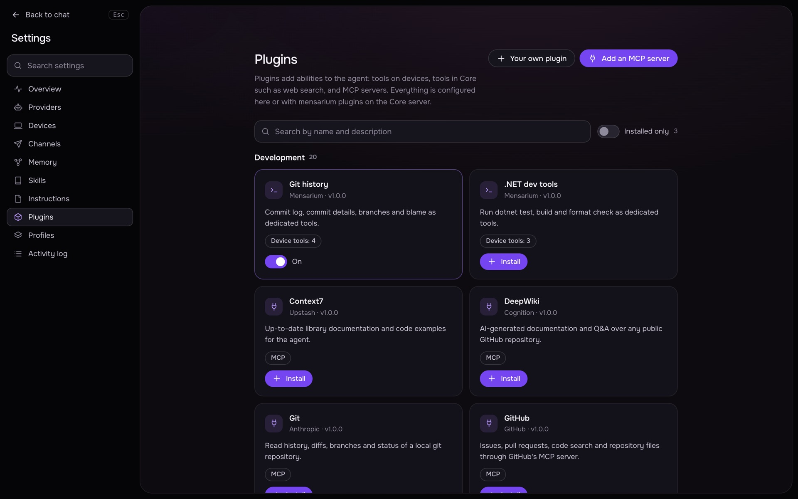

# Plugins

A plugin adds tools the agent can call: a command that runs on a device, a tool built into Core, or an MCP server running in Core or on a device. This page covers the kinds of plugin, the catalog, installing and configuring one, risk and approvals, device requirements, OAuth sign-in, how the agent can propose a plugin itself, and how to write your own plugin definition.



## Kinds of plugin

A plugin ([src/contracts/plugins.py](../src/contracts/plugins.py)) is any mix of:

- **Device command tools** (`tools`) — each one runs one allowlisted program on a device with pydantic-typed arguments filling whole `argv` elements (see [Writing a plugin](#writing-a-plugin) below).
- **A Core tool** (`builtin`) — one of the tools shipped with Mensarium itself: `web_search`, `web_fetch`, `google_gmail`, `google_drive` ([src/plugins/builtin.py](../src/plugins/builtin.py), [src/plugins/google.py](../src/plugins/google.py)). These run in Core, not on a device.
- **An MCP server** (`mcp`) — stdio (a command on a device) or streamable HTTP, running either in Core or on one chosen device. Its tools appear to the agent as `mcp.<server>.<tool>`.

A plugin needs at least one of the three; instructions for the model with no tool belong in a [skill](skills.md), not a plugin.

## The catalog

The catalog merges plugins bundled with Mensarium ([src/plugins/catalog/](../src/plugins/catalog/)) with the list published at `https://mensarium.com/dist/plugins.json` (configurable as `plugins.catalog_url` in `core/config.yaml`, cached 15 minutes); for a given id, the newer version wins ([src/core/catalog.py](../src/core/catalog.py)). If the remote catalog is unreachable, only the bundled plugins are shown and the page/CLI report the fetch error without failing.

Bundled plugins include: device command tool sets for `git`, `docker`, `kubectl`, several language toolchains and `gh`; the `web-search` / `web-fetch` Core tools; `google-gmail` / `google-drive`; and MCP servers for GitHub, GitLab, Slack, Notion, Linear, Postgres, MongoDB, Redis, Sentry, Stripe, Playwright, Figma, and more — run `mensarium plugins list --catalog` for the full, current list.

## Installing and configuring

**Settings → Plugins** lists installed plugins and the catalog (Marketplace), shows what each one provides, its settings form, current status, and an install/enable/disable/remove/probe ("Check") action.

CLI ([src/cli/plugins.py](../src/cli/plugins.py)):

```sh
mensarium plugins list [--catalog] [--json]
mensarium plugins info PLUGIN_ID
mensarium plugins install PLUGIN_ID_OR_YAML_PATH
mensarium plugins update PLUGIN_ID
mensarium plugins remove PLUGIN_ID [--yes]
mensarium plugins enable PLUGIN_ID
mensarium plugins disable PLUGIN_ID
mensarium plugins config PLUGIN_ID [KEY=VALUE ...] [--secret KEY] [--clear-secret KEY] [--placement core|DEVICE] [--risk read|execute|write|network|destructive]
mensarium plugins probe PLUGIN_ID     # reconnect its MCP server now and print its tools
```

`mensarium mcp` is the same commands scoped to MCP-server plugins, plus adding an ad hoc server without a catalog entry:

```sh
mensarium mcp list
mensarium mcp add NAME (--command "npx -y pkg ..." | --url URL) [--env K=V ...] [--secret-env K ...] [--header K=V ...] [--secret-header K ...] [--device NAME] [--risk ...] [--description TEXT]
mensarium mcp remove NAME [--yes]
mensarium mcp probe NAME
mensarium mcp tools NAME [--disable TOOL ...] [--enable TOOL ...]
```

`mensarium mcp add` creates a custom plugin (id `mcp-<name>`) whose secret env vars/headers become secret settings automatically.

Turning a plugin on/off, changing its settings, or moving its MCP server reconnects it (in Core) or resyncs it (on a device) right away.

## Settings and secrets

Each plugin declares its `config` fields (type, title, help text, default, required, optional `enum`/`minimum`/`maximum`); a field marked `secret: true` is entered write-only — the API and UI only ever report whether it is `set`, never its value. Secret values are stored as files in Core (`plugin-<id>-<key>`, see [src/core/config.py](../src/core/config.py) `read_secret`/`write_secret`) — this is separate storage from [user secrets](secrets.md), which the agent references by name instead. A plugin's `missing()` list (required fields with no value, plus an unpicked MCP placement or an unfinished OAuth sign-in) is what blocks it from starting.

## Risk levels and approvals

A plugin's tools carry a risk — `read`, `execute`, `write`, `network`, or `destructive` — either the plugin's declared default or an override you set in **Settings → Plugins → (plugin) → Risk**. An MCP tool the server itself marks `destructiveHint` is always treated as `destructive` regardless of that override. Risk determines whether a call needs your approval, the same way it does for built-in tools — see [Security model](security.md). Individual MCP tools can be hidden from the agent (`mensarium mcp tools NAME --disable TOOL`) without removing the whole server.

## Where a plugin's MCP server runs

An MCP server's `mcp.placement` is `core` or `device`; for a `device`-placement plugin you additionally pick *which* device in its settings. A plugin whose secrets fill in the MCP command/URL/headers can only be placed in Core (secrets never reach a device). Placement can be changed later (`--placement core|DEVICE_NAME`), which disconnects it from the old location and starts it on the new one.

### Device requirements

For an MCP server placed on a device (or a plugin's device command tools) to run there:

- The device's client must report `mcp.call` as an available tool — controlled by `allow_remote_plugins: true` in its config (default on; `mensarium client` pairing also asks for it). With it off, the Core marks any plugin placed there as errored ("the device is offline or its agent is too old for plugins" / "plugins from the Core are disabled on this device").
- A **stdio** MCP server's program must be in the device's command allowlist (`command_allowlist` in its config, or `*` for full access) — the same allowlist that gates `shell.exec` and device command-tool plugins ([src/client/mcp_host.py](../src/client/mcp_host.py), [src/client/config.py](../src/client/config.py)). The default allowlist covers common dev tools (`git`, `python`, `node`, `npm`, `go`, `cargo`, `make`, `grep`, ...); see [Clients](clients.md) for the full list and how to edit it.
- An HTTP MCP server has no such restriction — only the device's own network access matters.

The Core host's own built-in device follows the same rules through its `device` config section (`allow_remote_plugins` there defaults to `true` as well).

## OAuth sign-in

A plugin with an `oauth` block signs the user in through a browser redirect instead of a static token, in one of two ways ([src/core/oauth.py](../src/core/oauth.py), [src/core/plugins.py](../src/core/plugins.py)):

- **Discovery + Dynamic Client Registration** (`discover: true`, only for an `http`-transport MCP server): Core probes the server, follows RFC 9728 protected-resource metadata and RFC 8414 authorization-server metadata to find the provider, registers itself as an OAuth client via RFC 7591, and uses PKCE (S256) for the code exchange. The `mcp-context7`-style catalog entries without `oauth` skip this; **Slack**'s official MCP server uses fixed endpoints instead because it does not support DCR.
- **Fixed endpoints** (`authorize_url` + `token_url` + `client_id`, e.g. **Google** Gmail/Drive, **Slack**): you register your own OAuth client with the provider once (the plugin's `description` in the catalog explains the exact steps) and paste its client id/secret into the plugin's settings; PKCE is still used.

**GitHub**'s catalog plugin instead uses a personal access token (a secret setting), no OAuth flow.

Pressing **Connect** in the plugin's settings starts the flow; the browser is redirected back to `/v1/oauth/callback` and, on success, the tab closes itself. Tokens are stored as a Core secret and refreshed automatically shortly before they expire (or on a 401 from the server, one retry). A sign-in that cannot be refreshed (refresh token rejected, or none issued) is dropped, and the plugin's status asks you to reconnect. `optional_scopes` (a boolean config key mapped to an extra scope, e.g. Gmail's/Slack's "Allow sending") let a plugin request more only when you turn that setting on; changing it needs reconnecting.

### Redirect address

The provider is only willing to send the browser back to `https://` or a loopback address. `PluginManager.redirect()` picks, in order: the browser's own origin if it is `https` or already loopback; otherwise the loopback address of the gateway running on the browser's machine, if Core knows one (`ClientHub.gateway_loopback`); otherwise Core's own loopback port, with a **manual** fallback — you copy the URL the browser lands on and paste it back into the plugin's settings to finish the flow.

## The agent proposing a plugin

With extensions allowed for the active profile, the agent has two tools ([src/tool_runtime/registry.py](../src/tool_runtime/registry.py)):

| Tool | Risk | Behavior |
|---|---|---|
| `plugins.find` | read | Searches the catalog (name, summary, tags) for a capability the agent is missing; reports each match's install state and what setup it still needs. |
| `plugins.install` | execute, always asks | Installs (or turns on) a catalog plugin by id; for a device-placed MCP server, places it on the device of the current task. Waits for the MCP server to actually start before returning, so its tools are usable from the next step. |

If a plugin still needs settings only you can enter, or an OAuth sign-in, `plugins.install` reports that back to the agent instead of installing blind — it never asks you for a key or password in the chat itself. The agent cannot touch a plugin you installed from a custom manifest (source `custom`); it points you to Settings → Plugins instead.

## Writing a plugin

A plugin is a YAML (or JSON) manifest validated against `Plugin` ([src/contracts/plugins.py](../src/contracts/plugins.py)). Install a local file with `mensarium plugins install path/to/plugin.yaml` or `POST /v1/plugins/custom`.

Top-level fields:

| Field | Required | Notes |
|---|---|---|
| `id` | yes | `^[a-z0-9][a-z0-9-]{1,48}$` |
| `name`, `summary` | yes | String, or `{en: ..., ru: ...}` for translations |
| `version` | yes | `MAJOR.MINOR.PATCH` |
| `author`, `description`, `tags`, `homepage` | no | |
| `category` | no | One of `development`, `browser`, `web`, `databases`, `cloud`, `observability`, `productivity`, `communication`, `automation`, `system`, `other` (default `other`) |
| `config` | no | Map of setting name → field spec (see below) |
| `tools` | no | List of device command tools |
| `builtin` | no | One of the Core tool bundles listed above — only Mensarium's own bundled plugins use this |
| `mcp` | no | An MCP server template |
| `oauth` | no | An OAuth spec (needs `mcp` with `http` transport for `discover: true`, or fixed URLs otherwise) |

A `config` field:

```yaml
config:
  api_key:
    type: string          # string | integer | number | boolean (default string)
    title: {en: API key}
    help: {en: Where to get one}
    default: null
    required: true
    secret: true           # stored as a Core secret, write-only from the API/UI
    enum: null
    minimum: null
    maximum: null
    placeholder: null
    flag: null              # boolean fields used in an mcp template: the argv/env token inserted when true
```

A command tool (`tools[]`) runs one program with `{placeholder}` substitution from typed parameters — the shape used by, e.g., the bundled `git-history` plugin ([src/plugins/catalog/git-history.yaml](../src/plugins/catalog/git-history.yaml)):

```yaml
tools:
  - name: git.log
    description: Show recent commits, one line each.
    risk: read                                    # read | write | execute | network | destructive (default execute)
    argv: [git, log, --oneline, "--max-count={limit}", "{rev}"]
    cwd: "{repo}"
    timeout_s: 120
    parameters:
      repo: {description: Path inside the git worktree, default: "."}
      limit: {type: integer, default: 30, minimum: 1, maximum: 500}
      rev: {description: "Revision or range, e.g. main..HEAD"}
```

`argv[0]` must be a bare program name (no path, no placeholder) — it is what gets checked against the device's command allowlist. Every `{name}` used in `argv`/`cwd` must have a matching entry in `parameters`; a boolean parameter used in `argv` needs a `flag` (the literal token inserted when true).

An MCP server (`mcp`):

```yaml
mcp:
  transport: stdio            # or http
  command: npx                # stdio only, bare program name
  args: ["-y", "some-mcp-server", "--token", "{api_key}"]
  env: {}
  url: null                   # http only
  headers: {}
  placement: core              # core | device (device is picked per-installation)
  risk: network
```

Placeholders in `args`/`env`/`url`/`headers` are filled from `config`; every placeholder used there must be a declared `config` key, and vice versa there is no requirement that every `config` key be used.

### Minimal example

A single-tool plugin with no config, no secrets, no MCP:

```yaml
id: disk-usage
name: {en: Disk usage, ru: Место на диске}
version: 1.0.0
summary: {en: Show free disk space., ru: Показывает свободное место на диске.}
tools:
  - name: system.disk_usage
    description: Show free and used disk space for the device's root filesystem.
    risk: read
    argv: [df, -h]
```

## See also

- [Security model](security.md) — risk, approvals, signing and redaction that every plugin tool goes through.
- [Secrets](secrets.md) — the separate mechanism for secrets the agent uses by name in `shell.*`/`net.http`, as opposed to plugin config secrets.
- [Skills](skills.md) — instructions with no tools of their own.
- [Clients](clients.md) — the command allowlist and `allow_remote_plugins` on a device.
